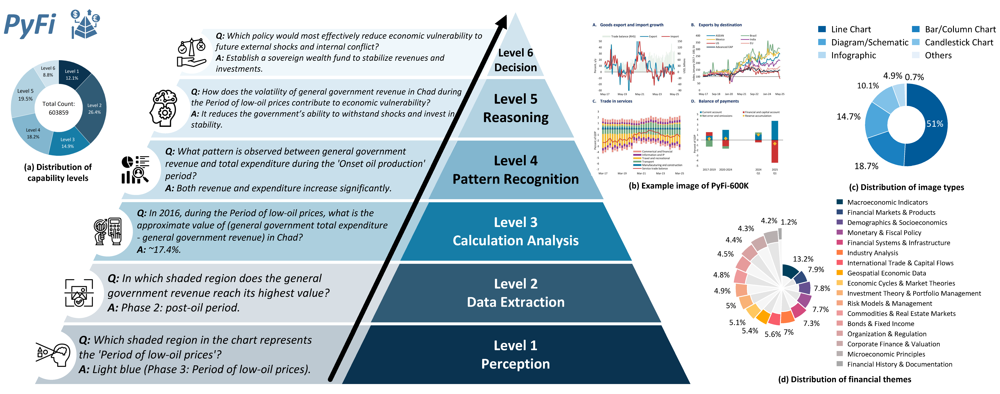

# PyFi

<div align="center">

<h3>Toward <strong><u>Py</u></strong>ramid-like <strong><u>Fi</u></strong>nancial Image Understanding for VLMs via Adversarial Agents</h3>


[](https://www.python.org/downloads/) [](https://opensource.org/licenses/Apache-2.0) [](https://github.com/AgenticFinLab/PyFi)



<p>
    A novel framework for financial image understanding leveraging pyramid-like adversarial agents
</p>
</div>

---

## Table of Contents

- [PyFi](#pyfi)
  - [Table of Contents](#table-of-contents)
  - [Overview](#overview)
    - [Key Features](#key-features)
    - [Publications](#publications)
    - [Resources](#resources)
  - [Architecture](#architecture)
  - [Installation](#installation)
    - [Prerequisites](#prerequisites)
    - [Setup](#setup)
  - [Quick Start](#quick-start)
    - [Basic Usage](#basic-usage)
  - [Dataset](#dataset)
    - [Capability Levels](#capability-levels)
    - [Key Features](#key-features-1)
    - [Access the Dataset](#access-the-dataset)
  - [Models](#models)
    - [Supported Models](#supported-models)
    - [Supervised Fine-Tuning (SFT)](#supervised-fine-tuning-sft)
  - [Evaluation](#evaluation)
    - [Evaluation Metrics](#evaluation-metrics)
    - [Results](#results)
    - [Key Findings](#key-findings)
  - [Usage Examples](#usage-examples)
    - [MCTS Tree Construction for Financial Analysis](#mcts-tree-construction-for-financial-analysis)
    - [Endgame QA Generation for Financial Images](#endgame-qa-generation-for-financial-images)
    - [Batch Processing with Context](#batch-processing-with-context)
  - [License](#license)
  - [Citation](#citation)
  - [Contact](#contact)

---

## Overview

PyFi (Pyramid-like Financial Image Understanding) is a cutting-edge framework designed to enhance Visual Language Models (VLMs) in understanding complex financial images through adversarial agents. The framework addresses the unique challenges in financial image analysis, including data scarcity, domain-specific complexity, and the need for hierarchical reasoning.

### Key Features

- **Pyramid-like Architecture**: Hierarchical reasoning framework for multi-level financial image understanding
- **Adversarial Agents**: Intelligent agents that generate challenging questions to improve VLM performance
- **Large-Scale Dataset**: 600K+ financial image-text pairs for robust model training and evaluation
- **Comprehensive Evaluation Benchmark**: Multi-dimensional assessment of VLM capabilities in financial domains
- **Modular Design**: Easily extensible to support new VLMs, datasets, and evaluation metrics

### Publications

- **PyFi: Toward Pyramid-like Financial Image Understanding for VLMs via Adversarial Agents**
  [https://arxiv.org/abs/2512.14735](https://arxiv.org/abs/2512.14735)

### Resources

- **Code**: [https://github.com/AgenticFinLab/PyFi](https://github.com/AgenticFinLab/PyFi)
- **Dataset**: [https://huggingface.co/datasets/AgenticFinLab/PyFi-600K](https://huggingface.co/datasets/AgenticFinLab/PyFi-600K)
- **Models**: [https://huggingface.co/collections/AgenticFinLab/PyFi-models](https://huggingface.co/collections/AgenticFinLab/pyfi-models)

---

## Architecture

For detailed architectural specifications, please refer to our [paper](https://arxiv.org/abs/2512.14735).

---

## Installation

**This Repo only provides code for data processing and building adversarial agents based on the Monte Carlo search tree paradigm.**


### Prerequisites

- Python 3.11 or higher

### Setup

1. **Clone the repository**:
   ```bash
   git clone https://github.com/AgenticFinLab/PyFi.git
   cd PyFi
   ```

2. **Create a virtual environment**:
   ```bash
   python -m venv venv
   source venv/bin/activate  # On Windows: venv\Scripts\activate
   ```

3. **Install the package**:
   ```bash
   pip install -e .
   ```

---

## Quick Start

### Basic Usage


```bash
# Run MCTS tree construction for financial images
python examples/mcts_tree/mcts_tree_main.py --base ./financial_data

# Generate endgame QA for financial images
python examples/mcts_tree/mcts_tree_gfa.py --base ./financial_data
```

**Note**: The `--base` parameter specifies the directory containing your financial images and context information. It should have the following structure:
```
financial_data/
├── images/         # Financial images to analyze
│   ├── group1/
│   │   ├── image1.png
│   │   └── image2.jpg
│   └── group2/
│       └── image3.png
└── context/        # Optional context information for images
    ├── group1.txt
    └── group2.txt
```

---

## Dataset

PyFi-600K is a large-scale financial image dataset comprising about **600K samples**, each containing:
- A financial image
- Question-answer (Q&A) pair
- Background information (caption, theme, context)
- Capability level and complexity degree

### Capability Levels
The dataset is organized into 6 hierarchical capability levels:
1. **Perception** (12.09%): Basic visual understanding
2. **Data Extraction** (26.43%): Foundational information retrieval
3. **Calculation Analysis** (14.94%): Numerical analysis tasks
4. **Pattern Recognition** (18.19%): Identifying trends and patterns
5. **Logical Reasoning** (19.50%): Complex logical analysis
6. **Decision Support** (8.85%): Strategic decision-making assistance

### Key Features
- **60,000+ sample chains**: Average length of 11.48 samples
- **Diverse question complexity**: From simple perception to advanced reasoning
- **Rich financial domain coverage**: Focus on stocks, economics, and financial analysis

### Access the Dataset
The PyFi-600K dataset is available on Hugging Face:
[https://huggingface.co/datasets/AgenticFinLab/PyFi-600K](https://huggingface.co/datasets/AgenticFinLab/PyFi-600K)


---

## Models

PyFi provides fine-tuned versions of popular VLMs for financial image understanding:

### Supported Models

| Model | Description | Hugging Face Link |
|-------|-------------|-------------------|
| PyFi-QwenVL-3B | Fine-tuned Qwen2.5-VL-3B-Instruct (w/o CoT) | [AgenticFinLab/PyFi-QwenVL-3B-47K](https://huggingface.co/AgenticFinLab/PyFi-QwenVL-3B-47K) |
| PyFi-QwenVL-3B-COT | Fine-tuned Qwen2.5-VL-3B-Instruct (w/ CoT) | [AgenticFinLab/PyFi-QwenVL-3B-COT-47K](https://huggingface.co/AgenticFinLab/PyFi-QwenVL-3B-COT-47K) |
| PyFi-QwenVL-7B | Fine-tuned Qwen2.5-VL-7B-Instruct (w/o CoT) | [AgenticFinLab/PyFi-QwenVL-7B-47K](https://huggingface.co/AgenticFinLab/PyFi-QwenVL-7B-47K) |
| PyFi-QwenVL-7B-COT | Fine-tuned Qwen2.5-VL-7B-Instruct (w/ CoT) | [AgenticFinLab/PyFi-QwenVL-7B-COT-47K](https://huggingface.co/AgenticFinLab/PyFi-QwenVL-7B-COT-47K) |


### Supervised Fine-Tuning (SFT)

PyFi models are fine-tuned on approximately 47K sample chains using two dataset variants:

- **With Chain-of-Thought (CoT)**: Each question chain is converted into a CoT reasoning sequence, where each reasoning step corresponds to a sub-question and its answer. A chain with $n$ samples yields a CoT sequence with $n$ reasoning steps.
- **Without Chain-of-Thought**: Only the question and answer from the final sample in the chain are used.

**Training Configuration:**
- **Optimizer**: AdamW with learning rate $1.0 \times 10^{-4}$
- **Learning Rate Schedule**: Cosine scheduling with warmup ratio of 0.1
- **Training Epochs**: 1 epoch
- **Batch Size**: Effective batch size of 8
- **Parameter-Efficient Fine-Tuning**: LoRA with full-module adaptation
- **Hardware**: Four NVIDIA RTX 5090 GPUs

---

## Evaluation

### Evaluation Metrics


### Results

The following table presents a comprehensive performance comparison of PyFi models across different capability levels on the evaluation dataset (samples=301, groups with image,PP=Perception, DE=Data Extraction,CA=Calculation Analysis, PR=Pattern Recognition, LR=Logical Reasoning, DS=Decision Support):

| Model | Overall | PP | DE | CA | PR | LR | DS |
|-------|---------|----|----|----|----|----|----|
| **Pre-trained VLMs** | | | | | | | |
| GPT-4.1 | 52.99 | 86.84 | 47.64 | 40.62 | 57.14 | 54.84 | 38.46 |
| InternVL3-38B | 52.91 | 76.32 | 56.37 | 44.53 | 43.88 | 53.23 | 30.77 |
| Claude-opus-4-1-20250805 | 64.70 | 80.92 | 62.74 | 66.02 | 58.16 | 72.58 | 32.69 |
| GLM-4.5V | 74.75 | 89.47 | 78.07 | 65.23 | 75.51 | 75.81 | 46.15 |
| DeepSeek-VL2 | 45.18 | 76.32 | 44.58 | 36.33 | 42.35 | 42.74 | 19.23 |
| Hunyuan-Large-Vision | 59.72 | 90.79 | 58.96 | 36.72 | 63.27 | 69.35 | 51.92 |
| ERNIE-4.5-turbo-vl | 34.47 | 34.87 | 33.96 | 36.72 | 25.00 | 45.16 | 36.54 |
| Moonshot-V1-128k-Vision-Preview | 54.57 | 80.92 | 61.08 | 39.06 | 41.84 | 58.87 | 38.46 |
| Moonshot-V1-32k-Vision-Preview | 54.40 | 80.26 | 61.56 | 37.11 | 40.31 | 62.90 | 38.46 |
| Moonshot-V1-8k-Vision-Preview | 54.90 | 80.26 | 61.79 | 39.84 | 42.35 | 58.06 | 38.46 |
| Qwen3-VL-Plus | 51.00 | 77.63 | 54.25 | 37.50 | 41.84 | 57.26 | 32.69 |
| Qwen2.5-VL-72B-Instruct | 48.84 | 70.39 | 59.91 | 33.20 | 35.71 | 46.77 | 26.92 |
| Qwen2.5-VL-32B-Instruct | 43.19 | 60.53 | 45.28 | 37.50 | 36.73 | 42.74 | 28.85 |
| Qwen2.5-VL-7B-Instruct | 37.87 | 54.61 | 49.53 | 34.77 | 18.37 | 24.19 | 15.38 |
| Qwen2.5-VL-3B-Instruct | 20.51 | 36.84 | 15.57 | 21.48 | 16.84 | 21.77 | 19.23 |
| **SFT VLMs, Trained with 500 Sample Chains** | | | | | | | |
| Qwen2.5-VL-3B-Instruct-L | 20.85 | 35.53 | 17.22 | 21.09 | 15.82 | 20.97 | 25.00 |
| PyFi-QwenVL-3B-500 | 26.74 | 34.87 | 28.77 | 28.52 | 16.84 | 24.19 | 21.15 |
| PyFi-QwenVL-3B-COT-500 | 27.66 | 37.50 | 28.77 | 26.17 | 22.45 | 25.81 | 21.15 |
| Qwen2.5-VL-7B-Instruct-L | 34.55 | 52.63 | 42.92 | 31.64 | 18.37 | 25.00 | 11.54 |
| PyFi-QwenVL-7B-500 | 43.44 | 71.05 | 44.58 | 43.36 | 30.10 | 37.90 | 17.31 |
| PyFi-QwenVL-7B-COT-500 | 39.53 | 61.84 | 41.51 | 40.23 | 26.02 | 34.68 | 17.31 |
| **SFT VLMs, Trained with 47K Sample Chains** | | | | | | | |
| Qwen2.5-VL-3B-Instruct-L | 20.85 | 35.53 | 17.22 | 21.09 | 15.82 | 20.97 | 25.00 |
| PyFi-QwenVL-3B-47K | 25.25 | 42.76 | 19.81 | 18.75 | 29.59 | 29.03 | 25.00 |
| PyFi-QwenVL-3B-COT-47K | 40.37 | 62.50 | 36.56 | 29.69 | 41.84 | 48.39 | 34.62 |
| Qwen2.5-VL-7B-Instruct-L | 34.55 | 52.63 | 42.92 | 31.64 | 18.37 | 25.00 | 11.54 |
| PyFi-QwenVL-7B-47K | 27.08 | 36.84 | 23.35 | 30.47 | 17.35 | 37.10 | 25.00 |
| PyFi-QwenVL-7B-COT-47K | 42.61 | 68.42 | 41.75 | 34.77 | 32.65 | 49.19 | 34.62 |

### Key Findings

1. **Pre-trained VLM Performance**: Among pre-trained models, GLM-4.5V achieves the highest overall accuracy (74.75%), demonstrating strong performance across all capability levels. However, even the best pre-trained models struggle with high-level decision support tasks, with GLM-4.5V achieving only 46.15% accuracy at the DS level.

2. **Pyramid-like Learning Effect**: Our PyFi models, fine-tuned on question chains arranged in a pyramid manner, show significant accuracy improvements, especially for smaller models. The PyFi-CoT models improve the 3B model by 19.52% points and the 7B model by 8.06% points over their local baselines.

3. **Scale and CoT Benefits**: Larger models benefit more from question-chain fine-tuning in challenging financial scenarios. At the Decision Support (DS) level, PyFi-CoT models improve performance significantly for both 3B and 7B variants.

4. **Progressive Reasoning**: Models equipped with question chains gain the ability to reason progressively from low-level to high-level questions, addressing financial problems step by step until reaching the solution.


---

## Usage Examples

### MCTS Tree Construction for Financial Analysis

```python
from fttracer.mcts.gqa import ImageQASystem

# Initialize the Image QA system
system = ImageQASystem()

# Analyze a financial report image with MCTS tree
report_path = "examples/financial_report.png"

# Run MCTS tree construction for comprehensive analysis
system.main(
    image_path=report_path,
    context_base_path="examples/context/"
)

```

### Endgame QA Generation for Financial Images

```python
from fttracer.mcts.gqa import ImageQASystem

# Initialize the Image QA system
system = ImageQASystem()

# Analyze a stock chart and generate endgame QA
stock_chart_path = "examples/stock_chart.png"

# Generate endgame QA focused on final analysis
system.main_gfa(
    image_path=stock_chart_path,
    context_base_path="examples/context/"
)

```

### Batch Processing with Context

```python
from fttracer.mcts.gqa import ImageQASystem
import os

# Initialize the Image QA system
system = ImageQASystem()

# Define base directory with images and context
base_dir = "examples/financial_data/"
images_dir = os.path.join(base_dir, "images")
context_dir = os.path.join(base_dir, "context")

# Process all images in the directory
for group_name in os.listdir(images_dir):
    group_path = os.path.join(images_dir, group_name)
    if os.path.isdir(group_path):
        for image_name in os.listdir(group_path):
            if image_name.endswith((".png", ".jpg")):
                image_path = os.path.join(group_path, image_name)
                print(f"Processing: {image_path}")
                
                # Run both analysis types
                mcts_analysis = system.main(image_path=image_path, context_base_path=context_dir)
                endgame_qa = system.main_gfa(image_path=image_path, context_base_path=context_dir)
                
       
```


---

## License

PyFi is released under the Apache 2.0 License:

```
Copyright 2025 AgenticFinLab

Licensed under the Apache License, Version 2.0 (the "License");
you may not use this file except in compliance with the License.
You may obtain a copy of the License at

    http://www.apache.org/licenses/LICENSE-2.0

Unless required by applicable law or agreed to in writing, software
distributed under the License is distributed on an "AS IS" BASIS,
WITHOUT WARRANTIES OR CONDITIONS OF ANY KIND, either express or implied.
See the License for the specific language governing permissions and
limitations under the License.
```

---

## Citation

If you use PyFi in your research, please cite our paper:

```bibtex
@article{pyfi2025,
  title={PyFi: Toward Pyramid-like Financial Image Understanding for VLMs via Adversarial Agents},
  author={Zhang, Yuqun and Zhao, Yuxuan and Chen, Sijia},
  journal={arXiv preprint arXiv:2512.14735},
  year={2025}
}
```

---

## Contact

For questions or inquiries about PyFi, please contact:

- **Email**: 
  - Yuqun Zhang: [research@yuqunzhang.com](mailto:research@yuqunzhang.com), 
  - Yuxuan Zhao: [yx.zhao129@gmail.com](mailto:yx.zhao129@gmail.com)
  - Sijia Chen: [sijiachen@hkust-gz.edu.cn](mailto:sijiachen@hkust-gz.edu.cn) (Corresponding author)
- **GitHub Issues**: 
  - [https://github.com/AgenticFinLab/PyFi/issues](https://github.com/AgenticFinLab/PyFi/issues)

---

<div align="center">
    <p>Built by the AgenticFin Lab</p>
    <p>© 2025 AgenticFin Lab. All rights reserved.</p>
</div>